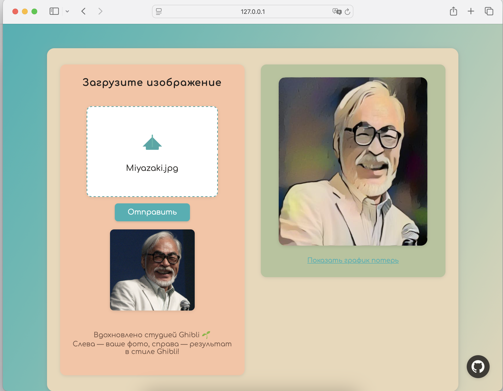

# Neural Style Transfer в стиле Studio Ghibli

В данном проекте реализован веб-сервис нейронного переноса стиля (Neural Style Transfer) на основе сверточной нейронной сети VGG19. Основная задача — преобразовать пользовательское изображение (контент) в стилистике эталонного изображения (стиля), сохраняя при этом структуру контента.


## Структура проекта

- **src/** — основной исходный код:
  - **main.py** — FastAPI веб-сервер для загрузки изображений, запуска style transfer и отображения результатов через веб-интерфейс.
  - **style_transfer/** — модуль с реализацией нейронного стиля:
    - **model.py** — загрузка и нормализация VGG19, вспомогательные классы.
    - **trainer.py** — основной цикл оптимизации, функции расчёта потерь и запуска style transfer.
    - **losses.py** — реализации StyleLoss и ContentLoss, расчёт Gram matrix.
    - **utils.py** — функции загрузки и предобработки изображений.
    - **service.py** — интеграция style transfer для вызова из веб-сервиса.
    - **experiment.py** — автоматизация и логирование экспериментов, построение графиков.
  - **templates/** — HTML-шаблоны для веб-интерфейса (форма загрузки и отображение результатов).
  - **styles/** — эталонные изображения стиля.
  - **sources/** — исходные (контентные) изображения для экспериментов.
  - **result/** — папка для сохранения результатов style transfer и графиков (используется веб-интерфейсом).
  - **uploads/** — временное хранилище загруженных пользователем изображений.
- **experiments/** — результаты и артефакты экспериментов (графики, итоговые изображения, summary-файлы).
- **REPORT.md** — отчёт с описанием экспериментов, методики, анализом и выводами.
- **README.md** — описание проекта.
- **pyproject.toml, poetry.lock** — зависимости проекта (Poetry).

---

## Пример интерфейса

Ниже показан внешний вид веб-сервиса для загрузки изображений и переноса стиля:




## Запуск веб-сервиса

1. Клонируйте репозиторий:

```bash
git clone https://github.com/denisnaenko/neural-style-transfer.git
cd neural-style-transfer
```

2. Установите зависимости из pyproject.toml и poetry.lock:

Убедитесь, что у вас установлен [Poetry](https://python-poetry.org/docs/).

```bash
poetry install
```

Poetry автоматически создаст виртуальное окружение и установит все нужные зависимости, зафиксированные в poetry.lock.

3. Для запуска веб-интерфейса используйте FastAPI и uvicorn. Выполните команды:

```bash
cd src
poetry run uvicorn main:app --reload --port 8000
```

4. После запуска перейдите в браузере по адресу:

```
http://localhost:8000/upload
```

Здесь вы сможете загрузить изображение и выполнить перенос стиля.