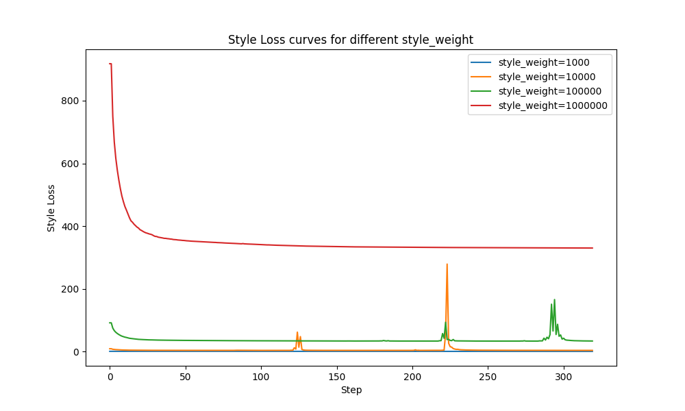
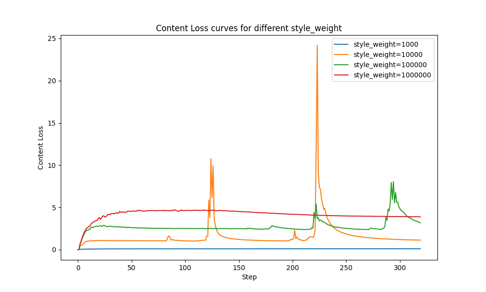
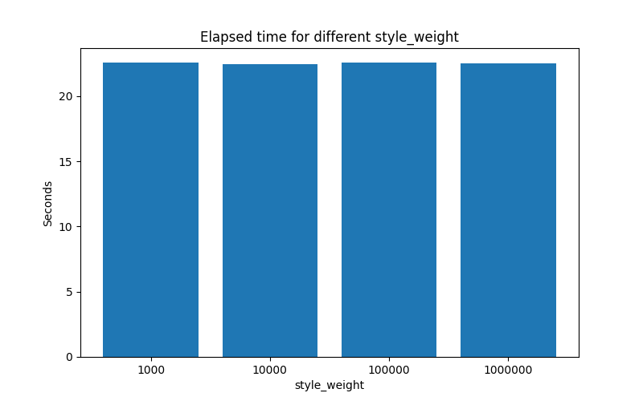
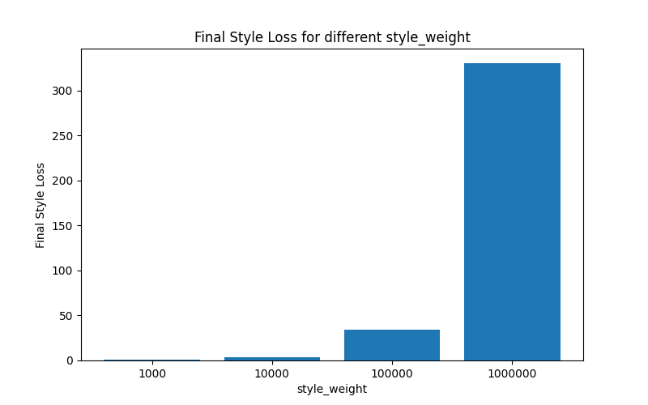

# Экспериментальная часть: исследование влияния параметра style_weight

### Цель эксперимента

Целью эксперимента является исследование влияния параметра `style_weight` на динамику сходимости, итоговые значения потерь (Style Loss, Content Loss), скорость работы и визуальное качество результата при переносе стиля в архитектуре Neural Style Transfer (NST) на базе VGG19.

### Методика

- В качестве контентного изображения использовался файл `sources/miyazaki.jpg`.
- В качестве стиля — набор изображений из папки `styles/` (см. репозиторий).
- Размер изображений: 512×512.
- Количество шагов оптимизации: 300.
- Оптимизатор: L-BFGS.
- Перебирались значения `style_weight`: 1e3, 1e4, 1e5, 1e6.
- Для каждого эксперимента сохранялись:
  - Кривые потерь (Style Loss, Content Loss) по шагам.
  - Итоговое изображение.
  - Время работы.
  - Финальные значения потерь.
  - Все результаты и графики доступны в директории `experiments/research_styleweight/`.

### Результаты

#### Динамика потерь

На рисунке 1 представлены кривые изменения Style Loss для разных значений `style_weight`:

*Рисунок 1. Динамика Style Loss при разных style_weight.*

Аналогично, на рисунке 2 — кривые Content Loss:

*Рисунок 2. Динамика Content Loss при разных style_weight.*

#### Время работы

На рисунке 3 показано время работы эксперимента для каждого значения `style_weight`:

*Рисунок 3. Время работы (сек) при разных style_weight.*

#### Финальные значения Style Loss

На рисунке 4 — финальные значения Style Loss после 300 шагов оптимизации:

*Рисунок 4. Финальный Style Loss при разных style_weight.*

#### Визуальные результаты

Ниже приведены примеры итоговых изображений для разных значений `style_weight` (см. папки `experiments/research_styleweight/exp_styleweight_XXXX/result.jpg`):

- 
- 
- 
- 

### Анализ и выводы

- При увеличении `style_weight` наблюдается ожидаемый рост влияния стиля на итоговое изображение: Style Loss становится доминирующим, Content Loss — менее значимым.
- Слишком малое значение `style_weight` приводит к слабому переносу стиля, изображение близко к оригиналу.
- Слишком большое значение `style_weight` приводит к сильному искажению контента, иногда с потерей узнаваемости исходного изображения.
- Время работы эксперимента практически не зависит от значения `style_weight` (см. рис. 3), так как число итераций фиксировано.
- Оптимальное значение `style_weight` подбирается эмпирически и зависит от желаемого баланса между сохранением структуры контента и выраженностью стиля.

---

**Все графики и результаты экспериментов доступны в папке [`experiments/research_styleweight/`](experiments/research_styleweight/).**